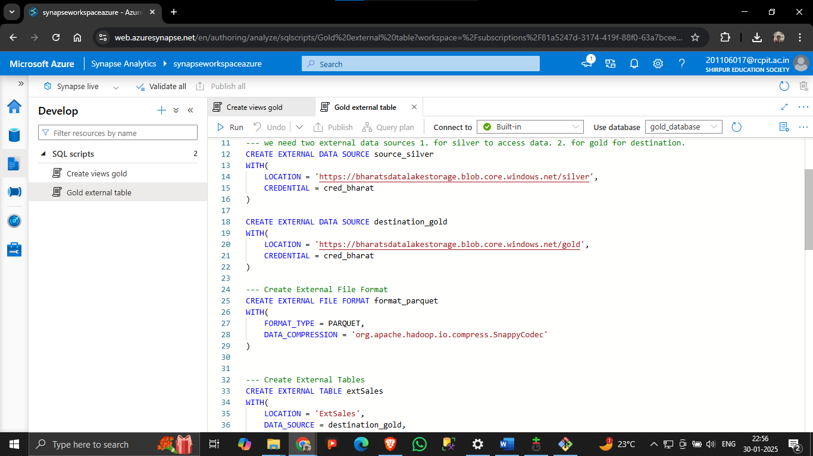
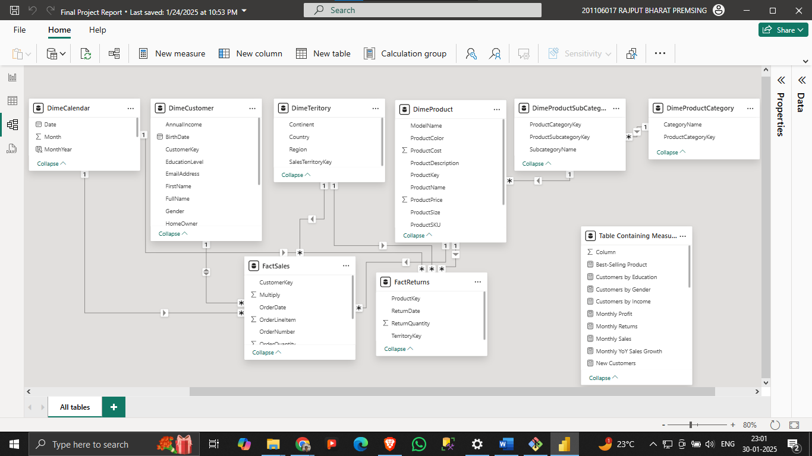

# 🚀 Azure Data Pipeline: From Ingestion to Visualization

This project demonstrates an **end-to-end data pipeline** using **Azure Data Factory, Azure Data Lake, Azure Synapse Analytics, and Power BI** to ingest, process, store, and visualize data.

---

## 📌 Architecture Overview

Below is the **high-level architecture** of the project:

# 🚀 Azure Data Pipeline: From Ingestion to Visualization

This project demonstrates an **end-to-end data pipeline** using **Azure Data Factory, Azure Data Lake, Azure Synapse Analytics, and Power BI** to ingest, process, store, and visualize data.

---

## 📌 Architecture Overview

Below is the **high-level architecture** of the project:

This pipeline follows these steps:
1. **Data Ingestion**: Raw data is fetched from an external HTTP source via **Azure Data Factory (ADF)**.
2. **Raw Data Storage**: The data is stored in **Azure Data Lake Gen2**.
3. **Data Transformation**: **Azure Databricks** processes and cleans the raw data.
4. **Serving & Analytics**: The transformed data is stored in **Azure Synapse Analytics** for querying.
5. **Fetching Data in Power BI**: The **Power BI** tool is connected to Synapse to import the transformed dataset.
6. **Data Modeling in Power BI**: The imported data is structured using **relationships, calculated measures, and columns** for effective reporting.
7. **Reporting & Visualization**: **Power BI dashboards** provide insights based on the processed data.

---

## 🔹 **Technology Stack**

| Tool                     | Purpose                                      | Icon |
|--------------------------|----------------------------------------------|------|
| **Data Source**           | External HTTP data ingestion                |  |
| **Azure Data Factory**    | Ingests raw data into Azure Data Lake        |  |
| **Azure Data Lake Gen2**  | Stores raw & processed data                  |  |
| **Azure Databricks**      | Transforms raw data                         |  |
| **Azure Synapse Analytics** | Enables analytics and querying             |  |
| **Power BI**              | Fetches data, models relationships, and creates reports |  |

---

## 🚀 Step-by-Step Implementation

### 1️⃣ Data Ingestion with Azure Data Factory (ADF)
- **Objective:** Fetch raw data from an HTTP source and store it in **Azure Data Lake Gen2**.
- **Process:**
  - Create a **Linked Service** in ADF to connect to the HTTP source.
  - Set up a **pipeline** to transfer the data into a raw storage container.
  - Execute the pipeline and monitor its progress.

📷 **Screenshot:** *Azure Data Factory Pipeline Configuration*  

📷 **Screenshot:** *Monitoring ADF Pipeline Execution*  

---

### 2️⃣ Raw Data Storage in Azure Data Lake Gen2
- **Objective:** Store raw files in **Azure Data Lake** for further processing.
- **Process:**
  - Navigate to **Azure Data Lake Storage**.
  - Verify that the raw data is stored in the correct **container**.

📷 **Screenshot:** *Raw Data Stored in Azure Data Lake*  

---

### 3️⃣ Data Transformation using Azure Databricks
- **Objective:** Process and clean raw data using **Apache Spark in Azure Databricks**.
- **Process:**
  - Create a **Databricks notebook** to read raw data from Azure Data Lake.
  - Apply transformations (cleaning, filtering, aggregations).
  - Store the transformed data back into Azure Data Lake.

📷 **Screenshot:** *Databricks Notebook with Transformation Code*  

📷 **Screenshot:** *Transformed Data Stored in Azure Data Lake*  

---

### 4️⃣ Data Analytics using Azure Synapse Analytics
- **Objective:** Load transformed data into **Azure Synapse Analytics** for querying.
- **Process:**
  - Create an **External Table** in Synapse to read data from Azure Data Lake.
  - Run SQL queries to analyze the transformed data.

📷 **Screenshot:** *Azure Synapse Analytics Workspace*  

## 📸 **Screenshots for Power BI Integration**  

### 🔹 Fetching Data in Power BI  
- **Objective:** Import transformed data from **Azure Synapse Analytics** into Power BI for reporting.  
- **Steps:**
  1. Open **Power BI**.
  2. Click **Get Data** → Select **Azure Synapse Analytics**.
  3. Enter **server details** and choose the **transformed dataset**.
  4. Click **Load** to import the data.

📷 **Screenshot:** *Fetching Data from Azure Synapse in Power BI*  

---

### 🔹 Data Modeling in Power BI  
- **Objective:** Structure and model the data for insightful reporting.  
- **Steps:**
  1. Navigate to the **Modeling Tab** in Power BI.
  2. Define **Relationships** between tables.
  3. Create **Calculated Measures** and **Columns** using **DAX**.
  4. Optimize the model for performance.

📷 **Screenshot:** *Power BI Data Modeling - Relationship View*  

### 📊 View the Power BI Report

Click the link below to open the Power BI report:

<iframe title="Final Project Report" width="1140" height="541.25" src="https://app.fabric.microsoft.com/reportEmbed?reportId=bc0350fe-4676-4afd-a009-59143269d699&autoAuth=true&ctid=35378ff2-8912-4402-91b9-2992f3c03da3" frameborder="0" allowFullScreen="true"></iframe>

