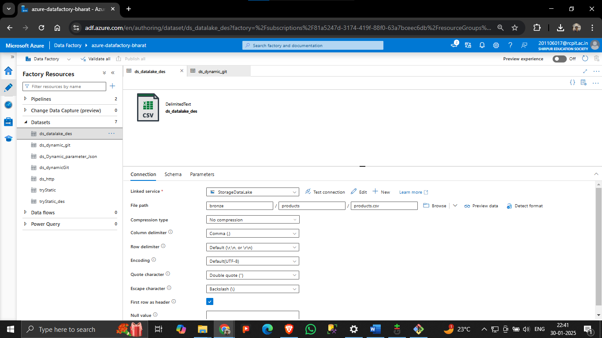

# 🚀 Azure Data Pipeline: From Ingestion to Visualization

This project demonstrates an **end-to-end data pipeline** using **Azure Data Factory, Azure Data Lake, Azure Synapse Analytics, and Power BI** to ingest, process, store, and visualize data.

---

## 📌 Architecture Overview

Below is the **high-level architecture** of the project:

This pipeline follows these steps:

1. **Data Ingestion**: Raw data is fetched from an external HTTP source via **Azure Data Factory (ADF)**.
2. **Raw Data Storage**: The data is stored in **Azure Data Lake Gen2**.
3. **Data Transformation**: **Azure Databricks** processes and cleans the raw data.
4. **Serving & Analytics**: The transformed data is stored in **Azure Synapse Analytics** for querying.
5. **Fetching Data in Power BI**: The **Power BI** tool is connected to Synapse to import the transformed dataset.
6. **Data Modeling in Power BI**: The imported data is structured using **relationships, calculated measures, and columns** for effective reporting.
7. **Reporting & Visualization**: **Power BI dashboards** provide insights based on the processed data.

---

## 🔹 **Technology Stack**

| Tool                        | Purpose                                                 | Icon                                                      |
| --------------------------- | ------------------------------------------------------- | --------------------------------------------------------- |
| **Data Source**             | External HTTP data ingestion                            |        |
| **Azure Data Factory**      | Ingests raw data into Azure Data Lake                   |         |
| **Azure Data Lake Gen2**    | Stores raw & processed data                             |   |
| **Azure Databricks**        | Transforms raw data                                     |  |
| **Azure Synapse Analytics** | Enables analytics and querying                          |               |
| **Power BI**                | Fetches data, models relationships, and creates reports |     |

---

## 🚀 Step-by-Step Implementation

### 1️⃣ Data Ingestion with Azure Data Factory (ADF)

- **Objective:** Fetch raw data from an HTTP source and store it in **Azure Data Lake Gen2**.
- **Process:**
  - Create a **Linked Service** in ADF to connect to the HTTP source.
  - Set up a **pipeline** to transfer the data into a raw storage container.
  - Execute the pipeline and monitor its progress.

📷 **Screenshot:** _Azure Data Factory Pipeline Configuration (Bronze Layer)_

📷 **Screenshot:** _Monitoring ADF Pipeline Execution_

---

### 2️⃣ Raw Data Storage in Azure Data Lake Gen2

- **Objective:** Store raw files in **Azure Data Lake** for further processing.
- **Process:**
  - Navigate to **Azure Data Lake Storage**.
  - Verify that the raw data is stored in the correct **container**.

📷 **Screenshot:** _Raw Data Stored in Azure Data Lake (Bronze Container)_

---

### 3️⃣ Data Transformation using Azure Databricks

- **Objective:** Process and clean raw data using **Apache Spark in Azure Databricks**.
- **Process:**
  - Create a **Databricks notebook** to read raw data from Azure Data Lake.
  - Apply transformations (cleaning, filtering, aggregations).
  - Store the transformed data back into Azure Data Lake.

📷 **Screenshot:** _Databricks Notebook with Transformation Code (Silver Layer)_  
**1. Get Data From Bronze Layer to Databricks**

**2. Transform Data in Azure Databricks**

**3. Store Transformed Data in Silver Container**

📷 **Screenshot:** _Transformed Data Stored in Azure Data Lake (Silver Container)_

---

### 4️⃣ Data Analytics using Azure Synapse Analytics

- **Objective:** Load transformed data into **Azure Synapse Analytics** for querying.
- **Process:**
  - Create an **External Table** in Synapse to read data from Azure Data Lake.
  - Run SQL queries to analyze the transformed data.

📷 **Screenshot:** _Azure Synapse Analytics Workspace (Gold Layer)_  
**1. Get Data From Silver Layer and Create Views in Azure Synapse**

**2. Create External Tables in Azure Synapse (gold_database)**

## 📸 **Screenshots for Power BI Integration**

### 🔹 Fetching Data in Power BI

- **Objective:** Import transformed data from **Azure Synapse Analytics** into Power BI for reporting.
- **Steps:**
  1. Open **Power BI**.
  2. Click **Get Data** → Select **Azure Synapse Analytics**.
  3. Enter **server details** and choose the **transformed dataset**.
  4. Click **Load** to import the data.

📷 **Screenshot:** _Fetching Data from Azure Synapse in Power BI_

---

### 🔹 Data Modeling in Power BI

- **Objective:** Structure and model the data for insightful reporting.
- **Steps:**
  1. Navigate to the **Modeling Tab** in Power BI.
  2. Define **Relationships** between tables.
  3. Create **Calculated Measures** and **Columns** using **DAX**.
  4. Optimize the model for performance.

📷 **Screenshot:** _Power BI Data Modeling - Relationship View_

---

### 🔹 Data Visualization in Power BI

- **Objective:** Create insightful and interactive reports.
- **Steps:**
  1. Navigate to the **Report View** in Power BI.
  2. Use **Visualizations Pane** to add charts, tables, and KPIs.
  3. Apply **Filters** and **Slicers** for interactivity.
  4. Format visuals for better readability.

📊 **Live Dashboard:** [View Power BI Dashboard](https://app.powerbi.com/view?r=eyJrIjoiNDgxOTU3ZTUtNDQ0OC00ZWI5LWFiNTktOGMyMThkZTQyNGM3IiwidCI6ImVjNTkxNDFlLTg0ZTctNGNjNy1iOTdiLTg1YjA3MmE2MTg4ZCJ9)
